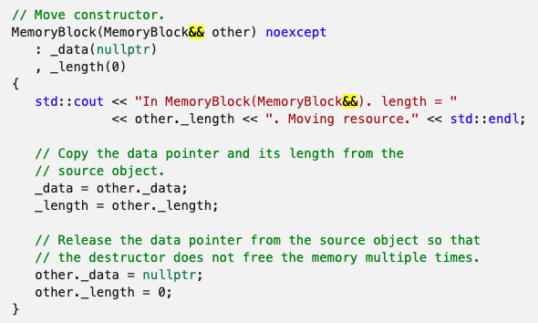

## Questions on move constructors and exchange operations

Why do __these example__ use exchange operations on nonclass-typed members?

[the first example (cppreference)](https://en.cppreference.com/w/cpp/language/move_constructor)

[std::exchange (cppreference)](https://en.cppreference.com/w/cpp/utility/exchange)


[another similar example (microsoft docs)](https://docs.microsoft.com/en-us/cpp/cpp/move-constructors-and-move-assignment-operators-cpp?view=msvc-170)



In my opinion, 

directly assignment is enough safe for initializing members in __primitive types (nonclass-type)__.

But, I don't understand why do some examples use a little bit expensive __`exchange`__ operations,

or set __nonclass-typed__ members to 0.

Is it because they want to set __the value to 0__? (we should do that for __pointers__ indeed, preventing doubly-free's)

__My own tests as following show:__

(Outputs printed using `objdump -C -D -S -l test.o > log_.log`)

This custom class has __a member `length`__, and this section as below is for __move constructor__

__`length(_src.length)`__

```assembly
; /Users/name/Desktop/frame/./byte_frame.h:102
;         , length(_src.length)
     cd8: 48 8b 55 f0                  	movq	-16(%rbp), %rdx
     cdc: 8b 72 08                     	movl	8(%rdx), %esi
     cdf: 48 8b 55 d8                  	movq	-40(%rbp), %rdx
     ce3: 89 72 08                     	movl	%esi, 8(%rdx)
```

__`length(std::exchange(_src.length, 0))`__

```assembly
; /Users/name/Desktop/frame/./byte_frame.h:102
;         , length(std::exchange(_src.length, 0))
     cdc: 48 83 c2 08                  	addq	$8, %rdx
     ce0: 48 8b 75 f0                  	movq	-16(%rbp), %rsi
     ce4: 48 83 c6 08                  	addq	$8, %rsi
     ce8: c7 45 e4 00 00 00 00         	movl	$0, -28(%rbp)
     cef: 48 8d 7d e4                  	leaq	-28(%rbp), %rdi
     cf3: 48 89 7d c0                  	movq	%rdi, -64(%rbp)
     cf7: 48 89 f7                     	movq	%rsi, %rdi
     cfa: 48 8b 75 c0                  	movq	-64(%rbp), %rsi
     cfe: 48 89 55 b8                  	movq	%rdx, -72(%rbp)
     d02: e8 00 00 00 00               	callq	0 <__ZN10byte_frameIsEC2EOS0_+0x77>
     d07: 89 45 b4                     	movl	%eax, -76(%rbp)
     d0a: e9 00 00 00 00               	jmp	0 <__ZN10byte_frameIsEC2EOS0_+0x7f>
     d0f: 48 8b 45 b8                  	movq	-72(%rbp), %rax
     d13: 8b 4d b4                     	movl	-76(%rbp), %ecx
     d16: 89 08                        	movl	%ecx, (%rax)
```
#
#### 註腳: 為什麼這個範例在移動建構式要用std::exchange或是歸零, 只做賦值又如何?
